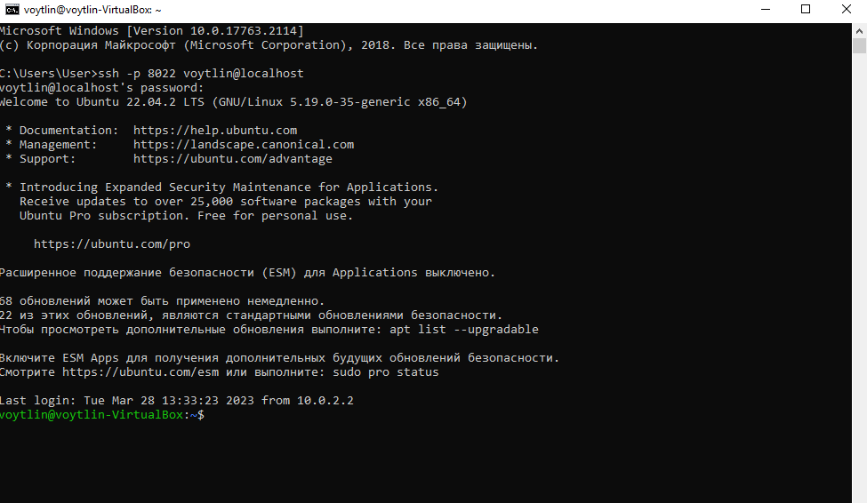
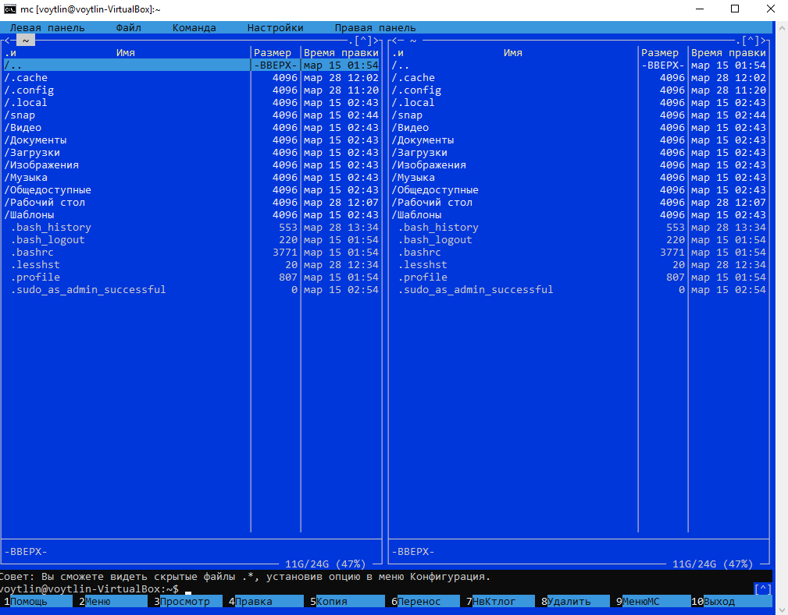

# Тема: Установка ОС Ubuntu в виртуальной машине. Работа в SSH-клиенте

## Для установки необходимо

* скачать и установить Virtualbox. <a href = "https://www.virtualbox.org/">Link</a>
* скачать и установить дистрибутив linux Ubutu Desktop с помощь Virtualbox, version — 22.04. <a href = "https://ubuntu.com/">Link</a>
* установить гостевые дополнения ОС. Установить Midnight Commander.
* установить SSH-клиент
* через SSH-соединение подключиться из хостовой ОС к виртуальной машине.

## Условия для успешной установки

* <a href = "https://gbcdn.mrgcdn.ru/uploads/asset/5079551/attachment/a4d56db48344352d548bcf990e50e7cf.png">компоненты windows</a> (Open command line {Win + R} and enter OptionalFeatures)
* <a href = "https://gbcdn.mrgcdn.ru/uploads/asset/5079553/attachment/12e5625a459808e612d1d23a7650f99e.png">изоляция ядра</a> (<a href = "https://gbcdn.mrgcdn.ru/uploads/asset/5079553/attachment/12e5625a459808e612d1d23a7650f99e.png">Сыылка на инструкцию</a>)
* <a href = "https://gbcdn.mrgcdn.ru/uploads/asset/5079555/attachment/921db35c03c1340e69e1283bd9288818.png">виртуализация вкл/выкл</a> (Open command line {Win + R} and enter taskmgr)
  

## Домашнее задание

* Приложить скриншон SSH-соединения и запущенный midnight commander. 

__Для выполнения домашнего задания использовались следующие команды:__

* sudo apt install gcc make perl - установка гостевых доплнений
* sudo usermod -aG vboxsf voytlin - добавили пользователя в группу
* sudo apt update - проверить работу сети перед установкой пакетов
* sudo apt install mc - установка файлового менеджера 
* sudo apt install openssh-server - установка SSH-клиента
* systemctl status ssh - проверить включен ли ssh-клиент
* ssh -p **** db@localhost - установка SSH- cоединения из хостовой системы
* uname - сведения о системе 
* uname -a - сведения о системе подробнее
* hostnamectl - сведения о системе